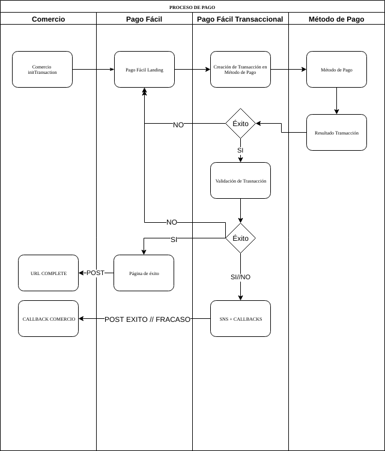

# Foco de esta documentación

### Proceso de Pagos.

El proceso de pago comienza con la creación de la transacción en Pago Fácil a través de ejecutar un POST al endpoint [**initTransaction**](crear-una-transaccion.md#inittransaction) correspondiente al [ambiente](endpoints.md#distincion-de-los-ambientes) en el cual queramos generar la transacción \(Desarrollo, Beta, y Producción\).

