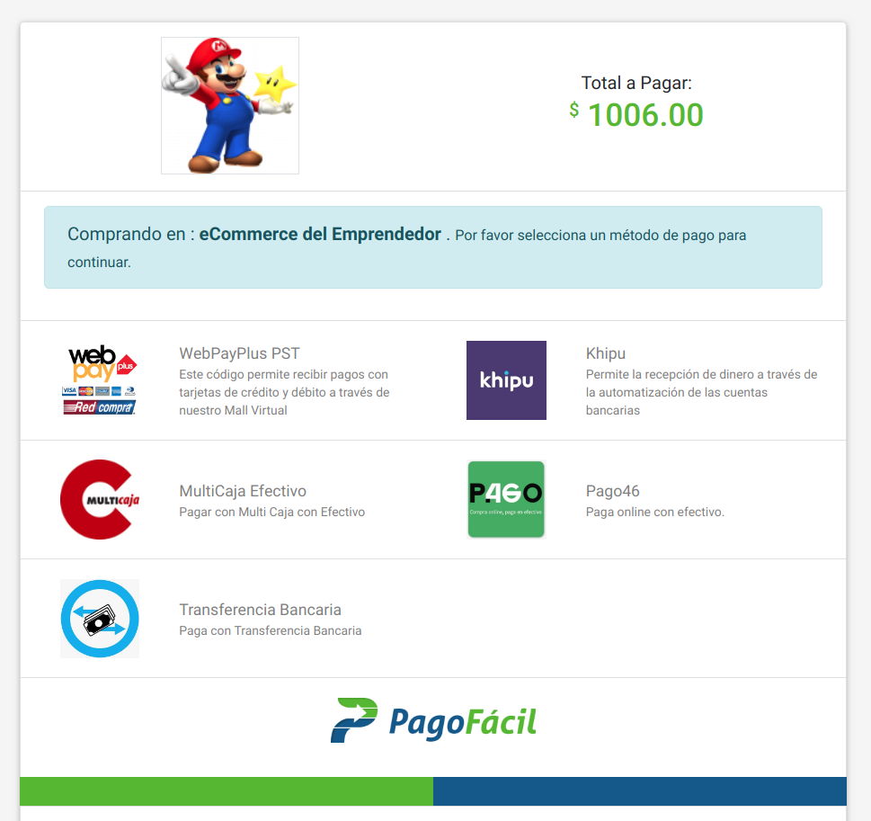

# Endpoints

### Distinción de los ambientes

| **Ambiente** | **Descripción** |
| :--- | :--- |
| **Desarrollo** | Acá podrás hacer tus integraciones y pruebas. Toda la información usada en este servidor es completamente ficticia. |
| **Beta** | Estos endpoints funcionan con los datos de producción, pero tienen las nuevas funcionalidades que aún se están probando. Las funcionalidades como nuevos métodos de pago pueden cambiar antes de pasar al servidor de producción. |
| **Producción** | En este ambiente se encuentran todas las funcionalidades ya probadas y es posible que sea el único al que necesites acceder. |

### Dashboards

En los dashboards crearás los distintos servicios que usarás en la plataforma. Es importante saber que si bien los usuarios son los mismos para el servidor de desarrollo y producción, los servicios asociados son completamente distintos.

* Desarrollo : [http://dashboard-dev.pagofacil.cl](http://dashboard-dev.pagofacil.cl)
* Beta : [http://dashboard-beta.pagofacil.cl/](http://dashboard-beta.pagofacil.cl/)
* Producción : [https://dashboard.pagofacil.cl](https://dashboard.pagofacil.cl)

### Crear Transacción

Para poder [crear una transacción](crear-una-transaccion.md#post-inittransaction) puedes usar los siguientes endpoints por POST \(URL ENCONDED\) dependiendo del entorno al cual te quieras conectar. Todos los endpoints solo aceptan conexiones https. Recuerda revisar la sección de como [crear una transacción](crear-una-transaccion.md) para ver los datos necesarios para inicializar el pago.

* Desarrollo : https://gw-dev.pagofacil.cl/initTransaction
* Beta : https://gw-beta.pagofacil.cl/initTransaction
* Producción : https://gw.pagofacil.cl/initTransaction

#### Ejemplo 



### Redirecciones a un único método de pago.

En el caso que no requieras mostrar la lista de métodos de pago, puedes especificar el método de pago con el cual deseas realices la transacción al hacer el post al [initTransaction](crear-una-transaccion.md).   Ejemplo : 

```http
POST: https://gw-dev.pagofacil.cl/initTransaction?method=WebPayPST
```

El ejemplo anterior si salta la pantalla en donde se muestran los distintos métodos de pago, y va directamente a Transbank. Los métodos soportados por el momento son los siguientes : 

* WebPayPST : Abre la ventana de pago de WebpayPlus
* Khipu : Abre la ventana de pagos a través de Khipu.
* MultiCajaCupon : Abre la ventana de pagos a través de MultiCaja con efectivo.
* Pago46 : Abre directamente la página de pagos de Pago46.

